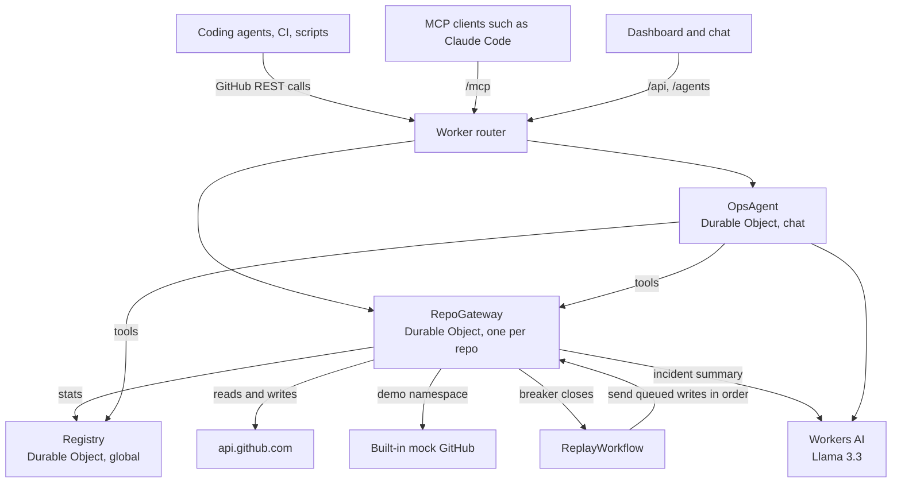

# Backstop

Backstop is a gateway on Cloudflare Workers that sits between AI coding agents and the GitHub REST API. It caches and coalesces reads, notices when GitHub is failing, serves cached data while it is down, and queues safe writes so a Cloudflare Workflow can replay them once GitHub recovers.

Live: https://cf-ai-backstop.gambier-toad-0c.workers.dev

Try it: open the link and press **Play the outage story**. In about 70 seconds you see normal traffic, a simulated GitHub blackout, reads served from cache, writes queued, recovery, the queue drained and an incident summary. Then ask the chat "what just happened?".

## Why

Coding agents read the same files again and again, poll often and retry at once when a call fails. When GitHub has a bad day, that turns into retry storms, stuck jobs and lost writes.

GitHub has had several bad days recently:

- On August 17, 2026 GitHub had an outage of several hours. Error rates reached about 20% for the web interface and API and about 50% for raw content and archive downloads. Actions, Copilot and enterprise sign-in were affected. GitHub has not published a root cause. ([DevOps.com](https://devops.com/github-hit-by-widespread-outage-halting-work-for-global-developers/))
- IncidentHub counted 57 GitHub Actions incidents between May 2025 and April 2026, out of 257 GitHub incidents in total. ([IncidentHub](https://blog.incidenthub.cloud/github-reliability-outage-history-2025-2026))
- In April 2026 GitHub said it had moved from planning for ten times its capacity to thirty times, because demand from AI-assisted development grew faster than expected. ([DevOps.com](https://devops.com/github-faces-scaling-issues-as-ai-development-surges/))

Backstop does not claim that AI traffic caused any of these outages. The claim is narrower: agents add load, and they behave badly when things fail. A layer between agents and GitHub can soften both.

## How it works



There are two namespaces. `/gh/*` goes to real GitHub. `/demo/gh/*` goes to a built-in mock GitHub (repos `demo/api`, `demo/web` and `demo/infra`), so anyone can try an outage without a token.

**Read path.** Every repo gets its own `RepoGateway` Durable Object with a SQLite cache. Responses are cached per token, so one caller never sees another caller's private data. Cache times are 60 seconds for repo metadata, 15 seconds for lists and 30 seconds for everything else. After that Backstop revalidates with the ETag, and GitHub answers 304 without a body and without counting it against the rate limit. Identical requests in flight at the same time share one upstream call.

**Circuit breaker.** Each repo has a breaker that watches the last 60 seconds of upstream calls. It opens after 5 failures in a row, an error rate of 50% or more over at least 10 calls, or a rate limit signal. While open it sends nothing to GitHub. After a cooldown (30 seconds, doubling up to 5 minutes) it lets one probe through. A good probe closes it.

**Degraded mode.** When GitHub fails or the breaker is open, reads come from the cache with `x-backstop-cache: STALE`. A read that was never cached gets a 503 with `Retry-After`, so agents back off instead of retrying at once. Every response carries `x-backstop-mode` (`normal` or `degraded`).

**Write queue and Workflow.** Only writes that are safe to delay are queued: creating issues, comments, labels, commit statuses for a full SHA and COMMENT reviews. They get a 202 and a queue id, and an `Idempotency-Key` makes retries safe. The caller's token is stored encrypted with AES-GCM and deleted once the write is done or dropped. Merges, updates and deletes are never queued; during an outage they fail fast with a reason. When the breaker closes, `ReplayWorkflow` sends the queued writes in enqueue order, retries short failures with backoff and skips writes GitHub rejects.

**Ops agent.** A chat agent built on the Agents SDK (`AIChatAgent`) with Llama 3.3 on Workers AI. It has nine tools. Five read real gateway state (overview, repo health, queue, recent events, incidents), three change the demo namespace (chaos, pause writes, replay) and one remembers repos to watch. Changes to the gateway need approval in the UI, and on the live namespace the chat refuses them. All gateway decisions are plain code. The model only explains state from tool results and phrases incident summaries from recorded facts, with a template as fallback when the model fails.

**MCP server.** `/mcp` exposes `github_read`, `github_write` and `backstop_status`. They go through the same gateway code as `/gh`, so an MCP client gets caching, stale reads and queued writes too.

The dashboard shows traffic figures, a repo table with breaker states, a per-repo queue and timeline, incidents and a chaos switch (normal, errors, slow, blackout).

## Assignment components

| Component | How Backstop uses it | Code |
| --- | --- | --- |
| LLM | Llama 3.3 70B (`@cf/meta/llama-3.3-70b-instruct-fp8-fast`) on Workers AI, for the ops chat and incident summaries | [src/agent/model.ts](src/agent/model.ts), [src/gateway/incident-summary.ts](src/gateway/incident-summary.ts) |
| Workflow and coordination | `ReplayWorkflow` replays queued writes in order with retries. Durable Objects coordinate per-repo state (cache, breaker, queue) and global stats | [src/workflows/replay.ts](src/workflows/replay.ts), [src/gateway/repo-gateway.ts](src/gateway/repo-gateway.ts), [src/gateway/registry.ts](src/gateway/registry.ts) |
| User input via chat | Chat panel next to the dashboard, connected to the `OpsAgent` over WebSockets | [src/ui/chat.tsx](src/ui/chat.tsx), [src/server.ts](src/server.ts) |
| Memory or state | Chat history persists in the agent's SQLite. Watched repos and the last seen incident live in agent state. Cache, breaker, queue, events and incidents live in Durable Object SQLite | [src/agent/state.ts](src/agent/state.ts), [src/agent/memory-tools.ts](src/agent/memory-tools.ts), [src/gateway/incidents.ts](src/gateway/incidents.ts) |

## Run locally

You need Node.js 22.18 or newer (built with Node 24) and a Cloudflare account. The chat and the incident summaries use Workers AI, which has no local version, so local runs call your account's Workers AI and use its daily allowance.

```bash
git clone https://github.com/3NiTiN3/cf_ai_backstop.git
cd cf_ai_backstop
npm install
npx wrangler login
cp .dev.vars.example .dev.vars
```

Put two long random strings in `.dev.vars` (for example from `openssl rand -hex 32`). `ADMIN_TOKEN` protects changes on the live namespace. `QUEUE_ENCRYPTION_KEY` encrypts the tokens of queued writes.

```bash
npm run dev
```

Open http://localhost:5173. The dashboard starts on the Demo namespace.

- Press **Play the outage story** and watch the Overview tab. Activity shows the queue and timeline for one repo, Incidents shows the summaries.
- Or use the chaos switch yourself: Blackout, send a few reads, then Normal and wait for the 30 second cooldown.
- Ask the chat things like "is demo/api healthy?" or "what is queued for demo/web?".

Other commands:

```bash
npm run check      # typecheck, lint and tests
npm run simulate -- --agents 20 --seconds 60
npm run evals      # tool-selection evals against the dev server
```

## Deploy

Wrangler checks that both secrets exist before it deploys, and `wrangler secret put` cannot set them before the Worker exists. So pass them with the first deploy. `.env.deploy` is ignored by git.

```bash
npx wrangler login
printf 'ADMIN_TOKEN=%s\nQUEUE_ENCRYPTION_KEY=%s\n' "$(openssl rand -hex 32)" "$(openssl rand -hex 32)" > .env.deploy
npm run deploy -- --secrets-file .env.deploy
```

`npm run deploy` builds the UI with Vite and runs `wrangler deploy`. Keep `ADMIN_TOKEN` somewhere safe, you need it for chaos and queue actions on the live namespace. Later deploys only need `npm run deploy`.

Bindings, all in [wrangler.jsonc](wrangler.jsonc) and created on deploy:

- `AI`: Workers AI
- `OpsAgent`, `RepoGateway`, `Registry`: Durable Objects with SQLite
- `ReplayWorkflow`: the `backstop-replay` Workflow
- `DEMO_GATEWAY_LIMITER`, `DEMO_ACTIONS_LIMITER`, `MCP_LIMITER`, `CHAT_LIMITER`: rate limits for the public demo, MCP and the shared chat

## Use it with agents

Point any GitHub REST client at `https://cf-ai-backstop.gambier-toad-0c.workers.dev/gh` instead of `https://api.github.com`, or at `/demo/gh` to try it without a token. [docs/USING_WITH_AGENTS.md](docs/USING_WITH_AGENTS.md) has Octokit and curl examples and the response headers.

To use it from Claude Code:

```bash
claude mcp add --transport http backstop https://cf-ai-backstop.gambier-toad-0c.workers.dev/mcp
```

[docs/MCP.md](docs/MCP.md) covers the tools, the live token header and `.mcp.json`.

## Results

From [docs/BENCHMARKS.md](docs/BENCHMARKS.md), measured against the deployed Worker:

- 20 simulated agents for 60 seconds on the demo namespace: about 85% of upstream calls avoided (median of three runs: 1,372 requests, 193 upstream calls). The goal was 60%. No request failed.
- 5 agents for 60 seconds against real GitHub, reads only: 79.8% avoided.
- A cache hit takes a median 337 ms from India. About 175 ms of that is the network to Cloudflare, most of the rest is the hop to the repo's Durable Object in another region.

Tool-selection evals: 22 of 22 cases pass (100%). A case passes when the model calls the expected tool and no forbidden one. Results are in [evals/results.md](evals/results.md).

The test suite (vitest in the Workers runtime) covers the breaker with an injected clock, cache scoping, queue order and idempotency, security guards and one end-to-end outage over HTTP that waits for the real cooldown.

## Design decisions and trade-offs

- **Plain code decides, the model explains.** Caching, the breaker and queueing are deterministic and tested. The model never makes a gateway decision, and incident facts are counted in code, so summaries cannot invent numbers.
- **One Durable Object per repo.** Cache, breaker and queue for a repo live together, so ordering and coalescing need no locks. The cost is latency: each request goes to the region where that repo's object lives.
- **Only queue writes that are safe to delay.** Replaying a merge or an update minutes later could do the wrong thing, so those fail fast with a reason instead of being queued.
- **Cache per token.** Private data is never shared between tokens, which means agents with different tokens get fewer cache hits.
- **Replay stops when GitHub goes down again.** A replay that meets an open breaker ends and puts the write back in the queue, and closing the breaker starts a fresh run. An earlier version waited on retry delays and held the queue for about 70 seconds after recovery.
- **Stateless MCP handler.** `/mcp` uses `createMcpHandler` instead of `McpAgent`, which the current docs mark as deprecated. It needs no extra Durable Object.

## Limitations and next steps

- REST only. No GraphQL and no git protocol, so `git clone` and `push` still go to github.com.
- A write that timed out may already have reached GitHub. Replaying it can create a duplicate, because GitHub has no idempotency keys for these endpoints.
- Chat replies appear all at once. Streaming from Llama 3.3 through `workers-ai-provider` doubles every token (cloudflare/ai#663), so the model is called without streaming for now.
- The demo chat is shared by all visitors, and so is its Workers AI allowance. On the free plan that is roughly 50 chat turns a day, and the chat says so when it runs out.
- Rate limits are per Cloudflare location and approximate.

Next I would add location hints so repo objects live near the agents that use them, cache invalidation from GitHub webhooks instead of fixed cache times, read caching for GraphQL, and per-team access to the dashboard and live actions.

## How this was built

I built Backstop with Claude Code, working from a written plan: a goal, ten phases of small tasks, validation gates for every task and phase, and a log of technical decisions. Each task was implemented, checked with `npm run check` and committed on its own, which is why the history has one commit per task. The plan files stayed local. The prompts from planning and every build session are in [PROMPTS.md](PROMPTS.md).

## License

MIT, see [LICENSE](LICENSE).
